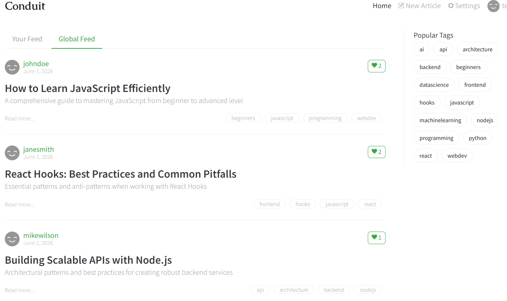

# QA Automation Assessment

## Author
Mohamed Ibrahim Aashiq

---

# Task 1 - Security Testing

## Website Tested

https://demo.realworld.show/

## Summary

I performed manual security testing on the Conduit demo application and identified five security-related issues. The findings mainly focus on authentication, session management, weak password policy, token handling, and missing brute-force protection.

---

## Vulnerability 1 - Weak Password Acceptance

The application allows users to create an account using a very weak password such as `"1"`.

The application allowed access to the home dashboard using a very weak password, which shows that password strength validation is not properly implemented.

**Impact:**
- Easier account compromise
- Weak password policy
- Higher risk of brute-force attacks

---

## Vulnerability 2 - No Email Verification for Signing Up

The application allows users to create an account and immediately access the platform without verifying ownership of the registered email address.

**Impact:**
- Attackers can register accounts using fake or invalid email addresses
- Reduced account authenticity
- Increased risk of spam or abuse

---

## Vulnerability 3 - JWT Token Exposure

After login, the JWT token is stored in Local Storage and can be accessed through browser developer tools.

**Impact:**
- Token theft through XSS attacks
- Session hijacking
- Unauthorized access if the token is stolen

---

## Vulnerability 4 - No Rate Limiting on Login Page

Multiple failed login attempts were allowed without restriction. I tested this by entering incorrect passwords repeatedly, and the application continued accepting login attempts.

**Impact:**
- Brute-force attacks
- Password guessing attacks
- Increased chance of account takeover

---

## Vulnerability 5 - Token Remains Valid After Logout

The JWT token remained valid even after logout. By using the previously copied token of user `test1@gmail.com`, it was still possible to send authenticated requests from `test2@gmail.com` and retrieve account information after the user had logged out.

**Impact:**
- Session hijacking
- Unauthorized account access
- Poor session invalidation mechanism

---

## Root Cause Analysis

The selected issue for root-cause analysis is **No Rate Limiting on the Login Page**.

The application allows unlimited failed login attempts without account lockout, CAPTCHA verification, or temporary delays after repeated failures. This increases the risk of brute-force attacks because an attacker can continuously guess passwords until the correct credentials are found. The issue becomes more critical when combined with weak password acceptance, because weak passwords are easier to guess. To fix this issue, the backend should limit failed login attempts by blocking or slowing requests after 3 to 5 unsuccessful attempts from the same account or IP address. The system should also display a clear message such as “Too many login attempts, please try again later.” Logging failed attempts should notify the analyst or security team to help detect suspicious activity. Implementing these methods would significantly reduce the risk of unauthorized access and improve the overall security of the application.

---
