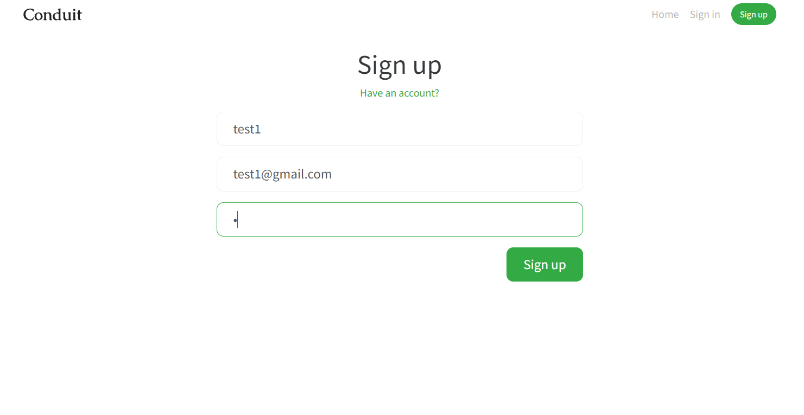
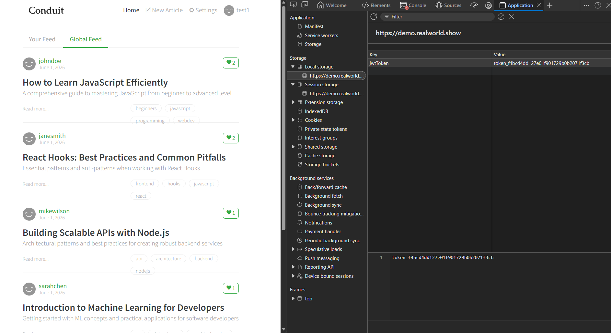
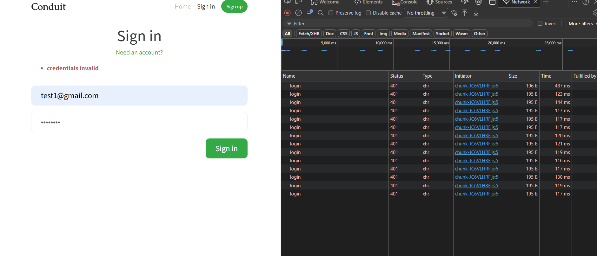
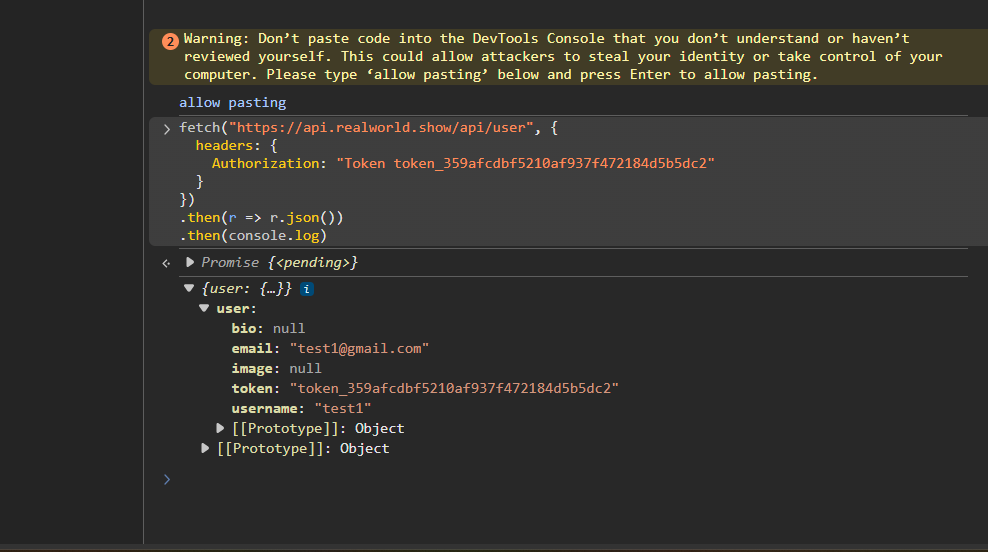

# QA Automation Assessment

## Author
Mohamed Ibrahim Aashiq

---

# Task 1 – Security Testing

Website Tested:

https://demo.realworld.show/

I performed manual security testing on the application and identified five security issues.

## Vulnerability 1 – Weak Password Acceptance

The application allows users to create an account using a very weak password such as "1".

**Impact:**
- Easier account compromise
- Weak password policy

---

## Vulnerability 2 – JWT Token Exposure

After login, the JWT token is stored in Local Storage and can be accessed through browser developer tools.

**Impact:**
- Token theft through XSS attacks
- Session hijacking

---

## Vulnerability 3 – No Rate Limiting on Login Page

Multiple failed login attempts were allowed without restrictions.

**Impact:**
- Brute-force attacks
- Password guessing attacks

---

## Vulnerability 4 – Token Remains Valid After Logout

The JWT token remained valid even after logout.

**Impact:**
- Session fixation
- Unauthorized account access

---

## Root Cause Analysis

The selected issue was:

**No Rate Limiting on Login Page**

The application allows unlimited failed login attempts without account lockout, CAPTCHA, or request throttling. This increases the risk of brute-force attacks and account compromise. Implementing rate limiting and stronger password policies would significantly improve security. :contentReference[oaicite:0]{index=0}

---

- GitHub
- Chrome DevTools
